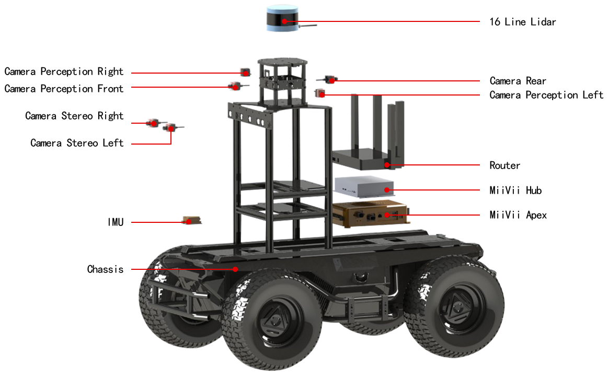

# MArmorF

MiiVii Mobile Armor Frame(MArmorF) is an outdoor AI robot platform. MArmorF is built with a 4WD chassis, a powerful computation unit--MiiVii Brain Apex, professional sensors like lidar and GMSL cameras and a MiiVii sensor fusion unit which provides pre-alignment for camera and lidar data. 

Maximum 8 GMSL cameras could be installed on MArmorF. All of the GMSL cameras could be synchronized with lidar and IMU at microsecond precision. 2 methods of synchronization are provided:

1. All sensors' data acquisition time are recorded. For camera, it is the shutter time. 
2. All cameras' shutters are triggered at the same time.

<p align="center">

</p>

## Compile
Clone the repository and build:
```
    mkdir -p ~/marmorf & cd ~/marmorf
    wstool init src
    wstool merge -t src https://raw.githubusercontent.com/MiiViiDynamics/marmorf/master/marmorf.rosinstall
    wstool update -t src
    catkin_make_isolated
    source devel_isolated/setup.bash
```

## Synchronization Comparation

## Features
Please refer the manual for detail, some key features listed as below.
1. 3D slam with synchornized lidar and camera
2. 2D detection with camera
3. 3D fusion detection with camera, lidar fusion.
4. Navigation with obstacle aware
5. Stereo camera
6. Visual odometry
7. Gazebo simulator support


## Contact
For technology issue, please file bugs on github directly.
For busniess contact, you can either 
1. visit our [taobao shop](https://shop324175547.taobao.com/?spm=a230r.7195193.1997079397.2.3154636cYGG7Vj)
2. mail to bd#miivii.com
