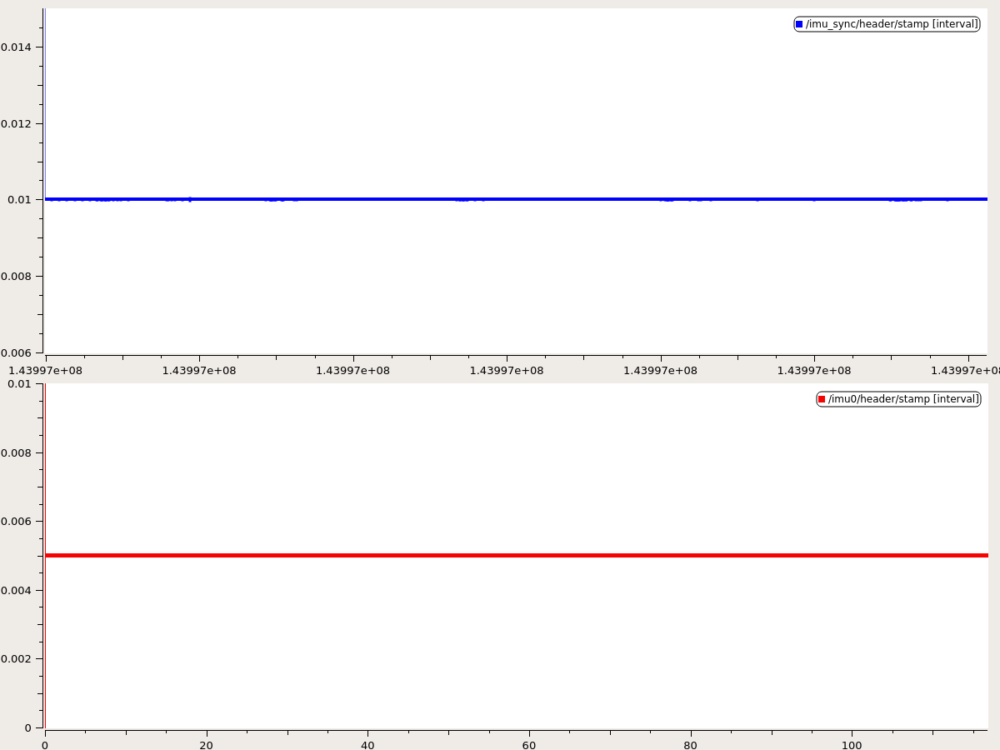
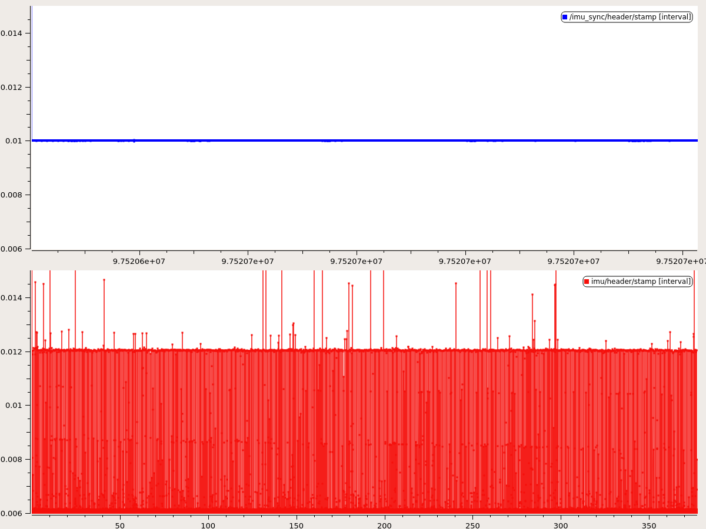
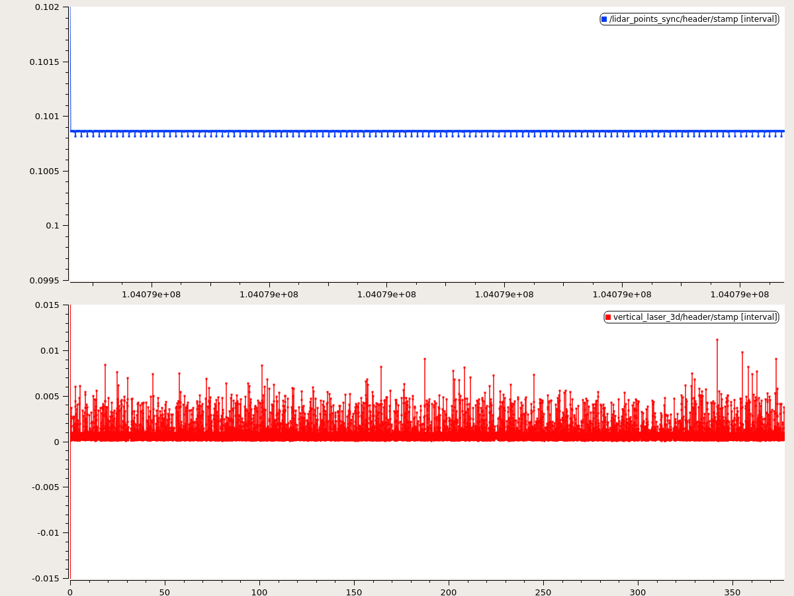
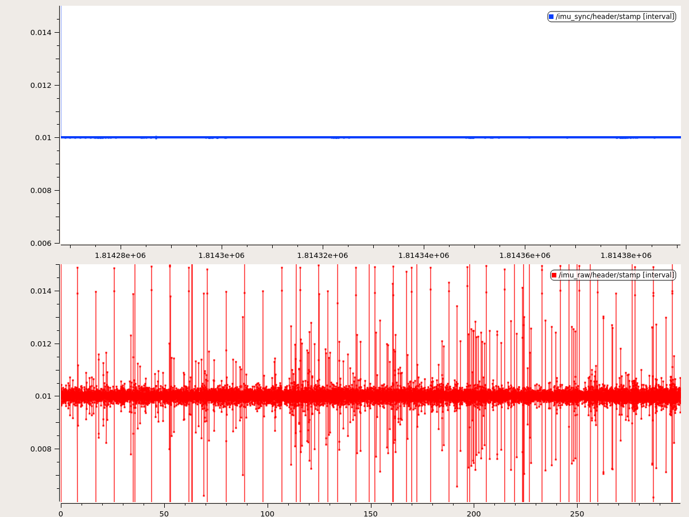
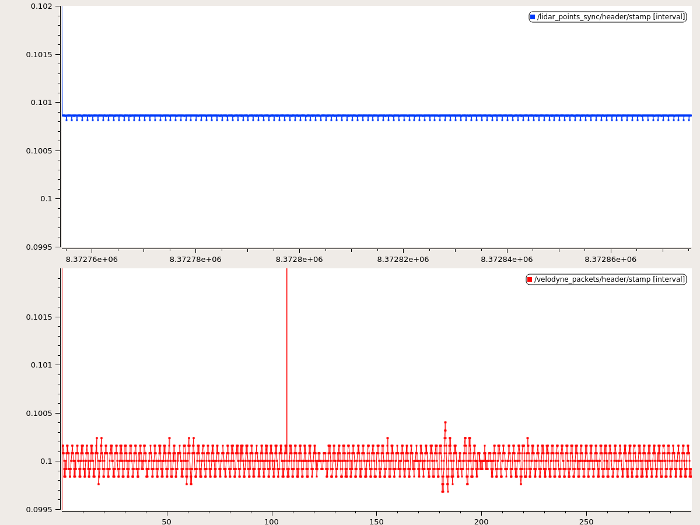
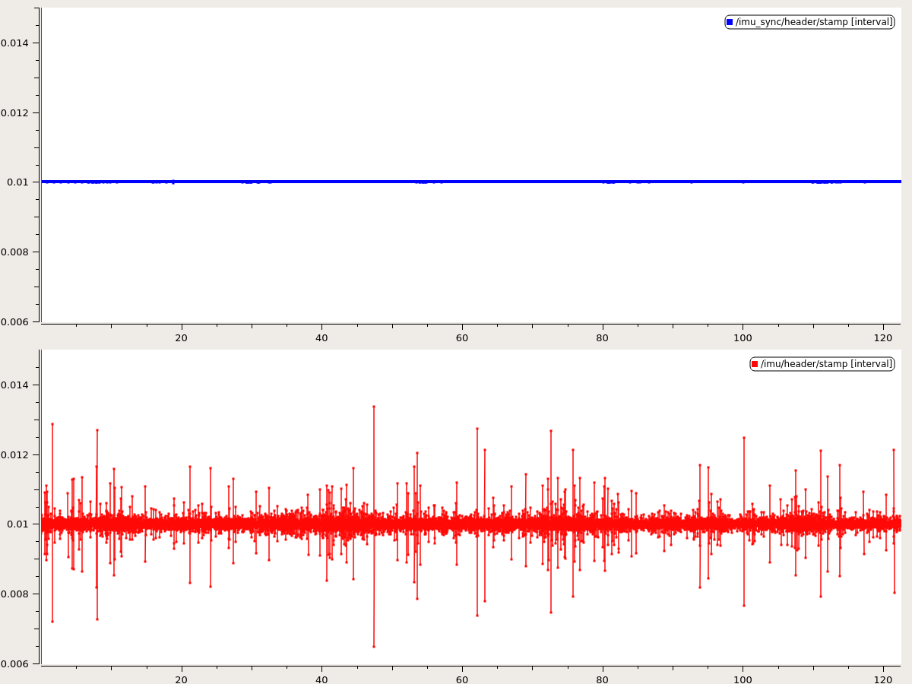
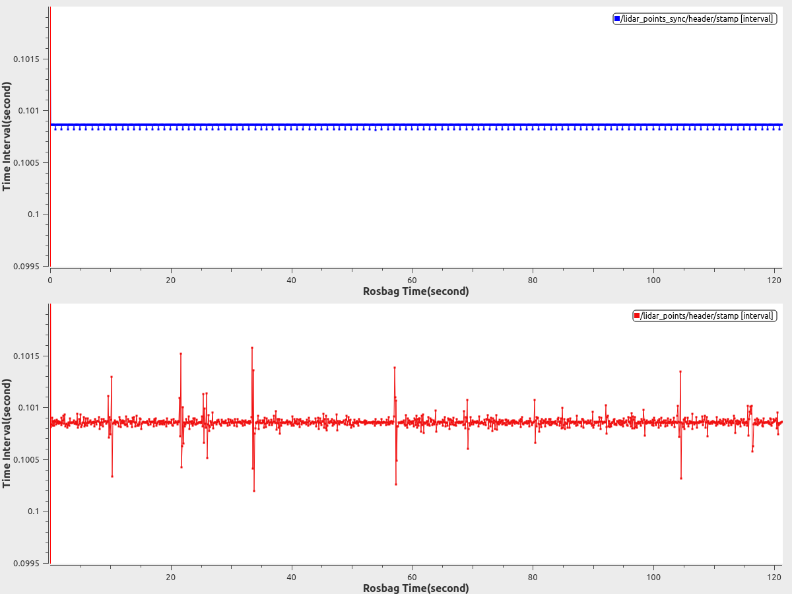
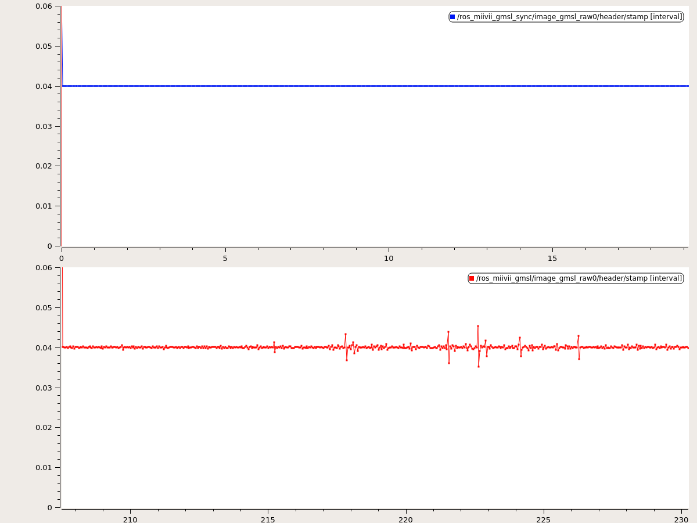

# MArmorF Synchronization

## Compare with public dataset
### MArmorF vs EuRoCMAVDatase
| Sensor      | Jitter Compare  EuRoCMAVDatase(red), MArmorF data(blue)     |
| ----------  | :-----------:  |
| IM    |       |

### MArmorF vs Cartographer
| Sensor      | Jitter Compare Cartographer(red), MArmorF data(blue)     | Sensor      | Jitter Compare not sync(red), MArmorF data(blue)|
| ----------  | :-----------:  | :-----------:  | :-----------:  |
| IM    |       |3d Lidar||

### MArmorF vs Autoware
| Sensor      | Jitter Compare Autoware(red), MArmorF data(blue)     | Sensor      | Jitter Compare  Autoware(red), MArmorF data(blue)|
| ----------  | :-----------:  | :-----------:  | :-----------:  |
| IM    |       |3d Lidar||

## Compare with unsync data
| Sensor      | Jitter Compare not sync(red), MArmorF data(blue)     | Sensor      | Jitter Compare not sync(red), MArmorF data(blue)|
| ----------  | :-----------:  | :-----------:  | :-----------:  |
| IMU (need imu support)     |       |3d Lidar||
| Camera      |       |||
